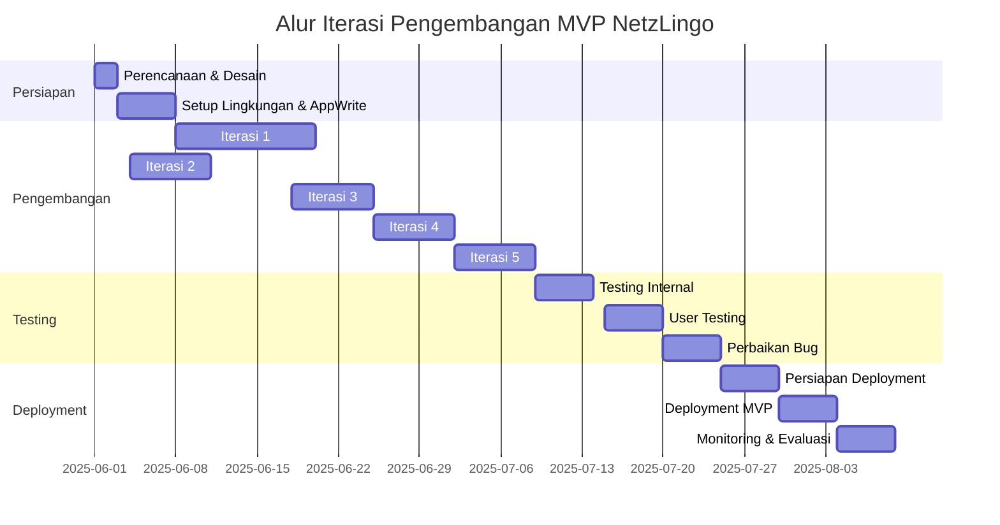
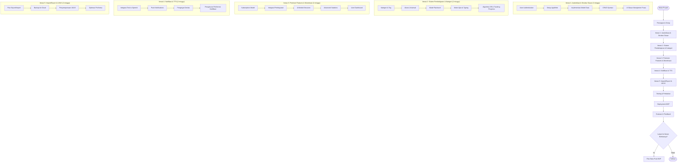
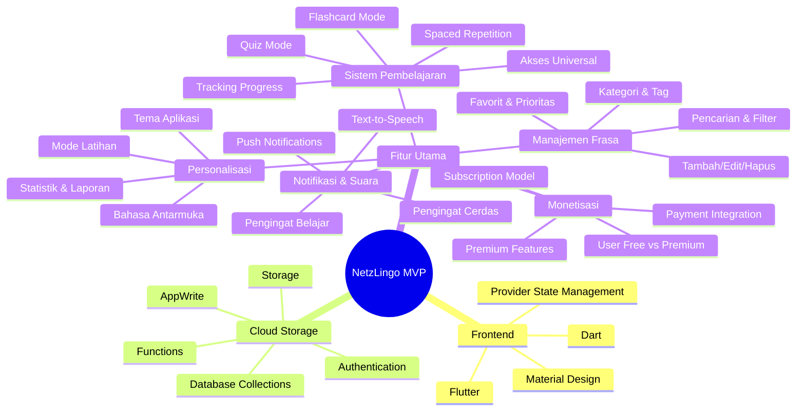
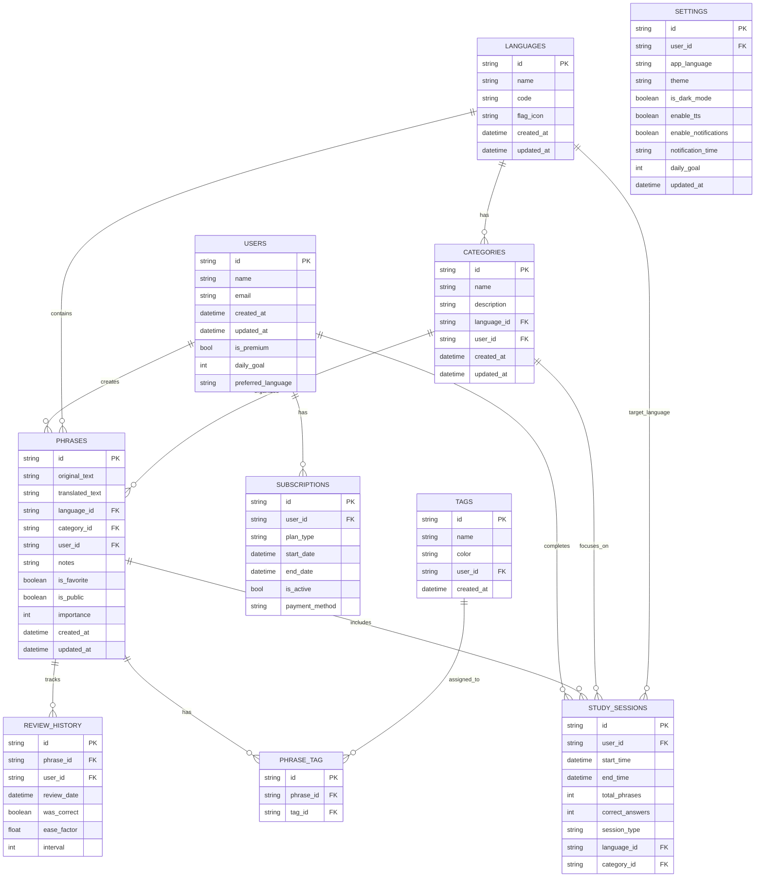

# Rencana Iterasi & Progress MVP Aplikasi NetzLingo

Penyusun: [Rizki Alan Habibi - 221240001238] Tanggal Update Terakhir: [04-06-2025]

## Pra-Iterasi: Persiapan & Setup Awal (Estimasi: 1 Minggu)

- Total Tasks: 7
- Tasks Selesai: 7
- Progress Iterasi: 100%
  - ✅ Pahami SRS Lagi
  - ✅ Setup Lingkungan Flutter (SDK, Editor, Emulator/Device)
  - ✅ Setup Project NetzLingo (Instalasi Lokal)
  - ✅ Buat Struktur Project Flutter Awal (Folders, Basic Files)
  - ✅ Integrasi Provider State Management
  - ✅ Setup AppWrite & Project Configuration
  - ✅ Konfigurasi Authentication System

## Iterasi 1: Autentikasi & Struktur Dasar (Estimasi: 2 Minggu)

- Total Tasks: 10
- Tasks Selesai: 10
- Progress Iterasi: 100%
  - ✅ Implementasi User Authentication (Register, Login, Logout)
  - ✅ User Profile & Settings
  - ✅ Setup AppWrite Collections
  - ✅ Implementasi Model Frasa & Data Dasar
  - ✅ Provider untuk Manajemen Frasa
  - ✅ UI: List Frasa dengan Card
  - ✅ UI: Form Tambah Frasa
  - ✅ UI: Form Edit Frasa
  - ✅ Fitur Hapus Frasa
  - ✅ Implementasi Sync Data

## Iterasi 2: Sistem Pembelajaran & Kategori (Estimasi: 2 Minggu)

- Total Tasks: 9
- Tasks Selesai: 4
- Progress Iterasi: 44%
  - ✅ Implementasi Kategori & Tag untuk Frasa
  - ✅ Integrasi Kategori pada Form Frasa
  - ✅ Implementasi Akses Universal untuk Tab Belajar (NEW)
  - ✅ Mode Latihan: Flashcard
  - 🟡 Mode Latihan: Quiz (Sedang dikerjakan)
  - 🟡 Mode Latihan: Typing (Sedang dikerjakan)
  - ⬜ Implementasi Algoritma Spaced Repetition
  - ⬜ Pelacakan Progress Belajar
  - ⬜ Implementasi Pencarian & Filter Lanjutan

## Iterasi 3: Premium Features & Monetisasi (Estimasi: 2 Minggu)

- Total Tasks: 6
- Tasks Selesai: 0
- Progress Iterasi: 0%
  - ⬜ Batasan 10 Sesi untuk User Free
  - ⬜ Implementasi Subscription Model
  - ⬜ Integrasi Pembayaran
  - ⬜ Premium Feature: Unlimited Sessions
  - ⬜ Premium Feature: Advanced Statistics
  - ⬜ User Dashboard (Free vs Premium)

## Iterasi 4: Notifikasi & TTS (Estimasi: 2 Minggu)

- Total Tasks: 6
- Tasks Selesai: 0
- Progress Iterasi: 0%
  - ⬜ Implementasi TTS Service
  - ⬜ Integrasi TTS dengan Mode Latihan
  - ⬜ Sistem Notifikasi (Push Notifications)
  - ⬜ Pengingat Cerdas
  - ⬜ Jadwal Notifikasi
  - ⬜ Preferensi Notifikasi

## Iterasi 5: Import/Export & UI/UX (Estimasi: 2 Minggu)

- Total Tasks: 6
- Tasks Selesai: 0
- Progress Iterasi: 0%
  - ⬜ Fitur Export Frasa (CSV/JSON)
  - ⬜ Fitur Import Frasa (CSV/JSON)
  - ⬜ Backup & Restore Data ke Cloud
  - ⬜ Penyempurnaan UI/UX Aplikasi
  - ⬜ Tema Terang/Gelap
  - ⬜ Optimasi Performa Aplikasi

## Testing & Deployment (Estimasi: 2 Minggu)

- Total Tasks: 5
- Tasks Selesai: 0
- Progress Iterasi: 0%
  - ⬜ Testing Internal
  - ⬜ Pengujian Pengguna
  - ⬜ Perbaikan Bug & Issue
  - ⬜ Persiapan Rilis
  - ⬜ Deployment ke Play Store

## Gantt Chart Timeline



## Flowchart Proses Pengembangan

> **Status Progress Saat Ini:**
> - Pra-Iterasi: ✅ Selesai (100%)
> - Iterasi 1 (Autentikasi & Struktur Dasar): ✅ Selesai (100%)
> - Iterasi 2 (Sistem Pembelajaran & Kategori): 🟡 Sedang Berjalan (44%)



## Mindmap Iterasi



## Kanban Board Status

> **Status Progress Saat Ini:**
> - 🟢 Selesai: Persiapan, Autentikasi & Struktur Dasar
> - 🟡 Sedang Dikerjakan: Sistem Pembelajaran & Kategori
> - 🔴 Belum Dimulai: Premium Features, Notifikasi & TTS, Import/Export & UI/UX, Testing, Deployment

```mermaid
stateDiagram-v2
    [*] --> Persiapan
    Persiapan --> Autentikasi
    Autentikasi --> SistemPembelajaran
    SistemPembelajaran --> PremiumFeatures
    PremiumFeatures --> NotifikasiTTS
    NotifikasiTTS --> ImportExportUIUX
    ImportExportUIUX --> Testing
    Testing --> Deployment
    Deployment --> [*]

    state Persiapan {
        [*] --> DesainProyek
        DesainProyek --> SetupLingkungan
        SetupLingkungan --> SetupAppWrite
    }

    state Autentikasi {
        [*] --> UserAuth
        UserAuth --> SetupCollections
        SetupCollections --> ModelData
        ModelData --> CRUDOperasi
    }

    state SistemPembelajaran {
        [*] --> KategoriTag
        KategoriTag --> AksesUniversal
        AksesUniversal --> ModeBelajar
        ModeBelajar --> AlgoritmaSR
    }

    state PremiumFeatures {
        [*] --> SubscriptionModel
        SubscriptionModel --> IntegrasiPembayaran
        IntegrasiPembayaran --> FiturPremium
        FiturPremium --> UserDashboard
    }

    state NotifikasiTTS {
        [*] --> IntegrasiTTS
        IntegrasiTTS --> PushNotifications
        PushNotifications --> PengingatCerdas
        PengingatCerdas --> PengaturanPreferensi
    }

    state ImportExportUIUX {
        [*] --> FiturExportImport
        FiturExportImport --> BackupRestore
        BackupRestore --> PenyempurnaanUIUX
        PenyempurnaanUIUX --> OptimasiPerforma
    }

    state Testing {
        [*] --> InternalTest
        InternalTest --> UserTest
        UserTest --> BugFix
    }

    state Deployment {
        [*] --> PreDeploy
        PreDeploy --> MVPRelease
        MVPRelease --> Monitoring
    }
```



## Ringkasan Progress per Iterasi

| Iterasi | Status | Durasi | Deliverables |
|---------|--------|---------|--------------|
| Persiapan | 🟢 Complete | 1 minggu | Desain, Setup Proyek, AppWrite Config |
| Autentikasi & Struktur Dasar | 🟢 Complete | 2 minggu | Auth, AppWrite Collections, CRUD, UI Dasar |
| Sistem Pembelajaran & Kategori | 🟡 In Progress | 2 minggu | Kategori, Akses Universal, Mode Latihan, Tracking |
| Premium Features & Monetisasi | 🔴 Not Started | 2 minggu | Subscription, Payment, Premium Features |
| Notifikasi & TTS | 🔴 Not Started | 2 minggu | Text-to-Speech, Push Notifications, Pengingat |
| Import/Export & UI/UX | 🔴 Not Started | 2 minggu | Import/Export, Backup, UI/UX Final |
| Testing | 🔴 Not Started | 3 minggu | Internal Test, User Test, Bug Fix |
| Deployment | 🔴 Not Started | 3 minggu | Persiapan, Release, Monitoring |

Legend:
- 🔴 Not Started
- 🟡 In Progress
- 🟢 Complete
- ✅ Finished

## Struktur Database AppWrite



## Catatan Penting Revisi:
- Perubahan utama dari SQLite ke AppWrite sebagai database cloud
- Penambahan fitur autentikasi pengguna (register, login, profile)
- Implementasi sistem monetisasi dengan subscription model
- Penambahan sinkronisasi data antar perangkat
- Pemanfaatan push notifications untuk pengingat belajar
- Backup & restore data ke cloud
- **NEW: Implementasi mode akses universal untuk memastikan akses fitur Belajar oleh semua jenis akun**

## Revisi dan Perbaikan yang Telah Dilakukan (Updated: 04-06-2025)

1. **Implementasi Akses Universal**:
   - Menambahkan mode pembelajaran universal yang berfungsi untuk semua jenis akun
   - Pembuatan data universal dengan userId 'universal' tersedia untuk akses publik
   - Sistem fallback bertingkat dari user data → universal data → static data

2. **Perbaikan Error AppWrite**:
   - Memperbaiki isu tipe data permissions (List<dynamic> → List<String>)
   - Optimasi penggunaan permissions API dengan menghindari literal list
   - Penanganan error 401 dengan beralih otomatis ke mode universal

3. **Dokumentasi Teknis**:
   - Membuat dokumentasi appwrite_configuration.md untuk panduan pengaturan izin
   - Menambahkan troubleshooting tips untuk masalah umum

## Rencana Pengerjaan Berikutnya (05-06-2025)

1. **Penyempurnaan Mode Pembelajaran**:
   - Menyelesaikan implementasi Mode Quiz dengan UI yang lebih menarik
   - Mengembangkan Mode Typing dengan validasi jawaban yang lebih baik
   - Integrasi sistem scoring yang konsisten

2. **Algoritma Spaced Repetition**:
   - Melengkapi implementasi algoritma SuperMemo untuk spaced repetition
   - Sistem perhitungan interval & ease factor yang adaptif
   - Optimasi alur review untuk efisiensi pembelajaran

3. **Pelacakan Progress**:
   - Dashboard kemajuan belajar dengan metrik kunci (completion rate, retention)
   - Visualisasi data belajar dengan grafik dan chart
   - Sistem streak dan reward untuk memotivasi konsistensi

4. **Optimasi UI/UX**:
   - Penyempurnaan tampilan kartu belajar dengan animasi yang lebih responsif
   - Desain feedback visual yang lebih intuitif saat menjawab benar/salah
   - Konsistensi UI di seluruh mode pembelajaran

## Struktur AppWrite yang Direvisi

1. **Perbaikan Setting Permissions**:
   - Collection Level: Menambahkan role 'any' dan 'guests' dengan permission read
   - Document Level: Menggunakan `List<String>` untuk permissions dengan format yang konsisten
   - Universal Access: Data dengan user_id='universal' dapat diakses semua pengguna

2. **Mode Fallback**:
   - Sistem layering data: User Personal → Universal → Static Default
   - Penanganan error bertingkat untuk memastikan aplikasi tetap berfungsi meski terjadi error

## Rincian Implementasi AppWrite & Flutter

### Persiapan (1 minggu)

#### Setup Project
```bash
# Inisialisasi proyek Flutter
flutter create netzlingo
cd netzlingo

# Instalasi dependensi
flutter pub add appwrite
flutter pub add provider
flutter pub add flutter_tts
flutter pub add firebase_messaging
flutter pub add firebase_core
flutter pub add shared_preferences
flutter pub add intl
flutter pub add uuid
flutter pub add csv
flutter pub add file_picker
flutter pub add permission_handler
flutter pub add fl_chart
flutter pub add flutter_secure_storage
flutter pub add in_app_purchase
```

#### Struktur Proyek
```
├── lib/
│   ├── main.dart
│   ├── app.dart
│   ├── config/
│   │   ├── appwrite_constants.dart
│   │   └── app_constants.dart
│   ├── screens/
│   │   ├── auth/
│   │   │   ├── login_screen.dart
│   │   │   ├── register_screen.dart
│   │   │   └── profile_screen.dart
│   │   ├── home/
│   │   ├── phrase_management/
│   │   ├── study/
│   │   ├── statistics/
│   │   ├── subscription/
│   │   └── settings/
│   ├── widgets/
│   │   ├── auth/
│   │   ├── phrase/
│   │   ├── study/
│   │   ├── common/
│   │   ├── subscription/
│   │   └── statistics/
│   ├── models/
│   │   ├── user_model.dart
│   │   ├── language.dart
│   │   ├── category.dart
│   │   ├── phrase.dart
│   │   ├── tag.dart
│   │   ├── review_history.dart
│   │   ├── study_session.dart
│   │   ├── subscription.dart
│   │   └── settings.dart
│   ├── providers/
│   │   ├── auth_provider.dart
│   │   ├── language_provider.dart
│   │   ├── phrase_provider.dart
│   │   ├── study_provider.dart
│   │   ├── subscription_provider.dart
│   │   └── settings_provider.dart
│   ├── services/
│   │   ├── appwrite_service.dart
│   │   ├── auth_service.dart
│   │   ├── database_service.dart
│   │   ├── tts_service.dart
│   │   ├── notification_service.dart
│   │   ├── spaced_repetition_service.dart
│   │   ├── subscription_service.dart
│   │   └── import_export_service.dart
│   └── utils/
│       ├── constants.dart
│       ├── helpers.dart
│       ├── validators.dart
│       └── formatters.dart
├── assets/
└── pubspec.yaml
```

## Implementasi Universal Access Mode (NEW)

### Konfigurasi Permissions AppWrite
```dart
// Metode yang benar untuk mengatur permissions
List<String> permissions = [];
permissions.add(Permission.read(Role.any()));
permissions.add(Permission.read(Role.users()));
permissions.add(Permission.read(Role.guests()));
permissions.add(Permission.update(Role.user(userId)));

// Untuk data universal
List<String> universalPermissions = [];
universalPermissions.add(Permission.read(Role.any()));
universalPermissions.add(Permission.read(Role.guests()));
universalPermissions.add(Permission.update(Role.any()));
```

### Fallback Data Universal
```dart
// Implementasi getPublicPhrases dengan fallback bertingkat
Future<List<Phrase>> getPublicPhrases({
  String? languageId,
  String? categoryId,
  int limit = 20,
}) async {
  try {
    print("Getting public phrases for all users");
    List<String> queries = [];
    
    // Pendekatan permisif - coba cari frasa universal dulu
    queries.add(Query.equal('user_id', 'universal'));
    
    // Filter tambahan jika diperlukan
    if (languageId != null) {
      queries.add(Query.equal('language_id', languageId));
    }
    
    // Batasi jumlah frasa
    queries.add(Query.limit(limit));

    final documentList = await _databases.listDocuments(
      databaseId: AppwriteConstants.databaseId,
      collectionId: AppwriteConstants.phrasesCollection,
      queries: queries,
    );
    
    List<Phrase> phrases = documentList.documents
        .map((doc) => Phrase.fromDocument(doc))
        .toList();
    
    // Jika tidak menemukan frasa universal, coba cari frasa publik
    if (phrases.isEmpty) {
      print("No universal phrases found, trying public phrases");
      queries = [Query.equal('is_public', true)];
      
      // [filter lanjutan...]
      
      final publicDocuments = await _databases.listDocuments(
        // [parameters...]
      );
      
      phrases = publicDocuments.documents
          .map((doc) => Phrase.fromDocument(doc))
          .toList();
    }
    
    // Jika masih tidak menemukan frasa, gunakan frasa statis
    if (phrases.isEmpty) {
      print("No public phrases found in database, using static fallback");
      return getDefaultStaticPhrases();
    }
    
    return phrases;
  } catch (e) {
    print("Error getting public phrases: $e");
    // Jika gagal, kembalikan frasa default statis
    return getDefaultStaticPhrases();
  }
}
```

## 11. Milestone Penting Revisi

| Milestone | Indikator Keberhasilan | Estimasi |
|-----------|------------------------|----------|
| AppWrite Integration | Konfigurasi AppWrite dan Auth berfungsi | Minggu 2 |
| User Authentication | Register, Login, Profile berfungsi | Minggu 3 |
| Data Sync | Sinkronisasi data antar perangkat berfungsi | Minggu 5 |
| Universal Access | Akses fitur Belajar tanpa login berfungsi | Minggu 5 (✅ DONE) |
| Premium Features | Subscription dan pembayaran berfungsi | Minggu 7 |
| Push Notifications | Notifikasi pengingat belajar berfungsi | Minggu 9 |
| UI/UX Final | Semua antarmuka dipoles dan responsif | Minggu 11 |
| Testing Selesai | Semua bug utama teridentifikasi dan diperbaiki | Minggu 14 |
| MVP Ready | Aplikasi siap untuk rilis awal | Minggu 16 |
