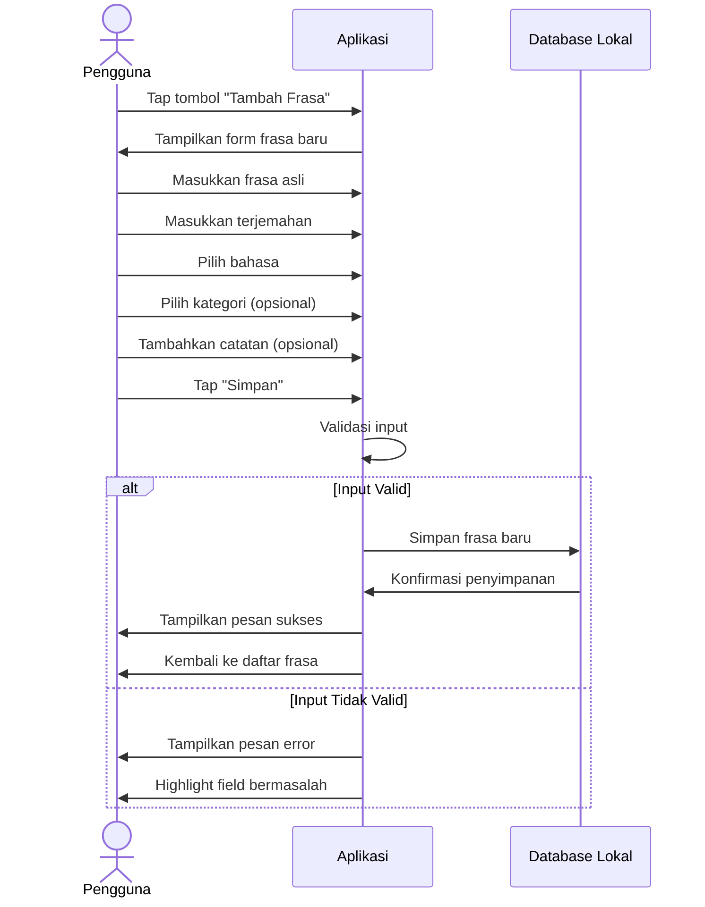
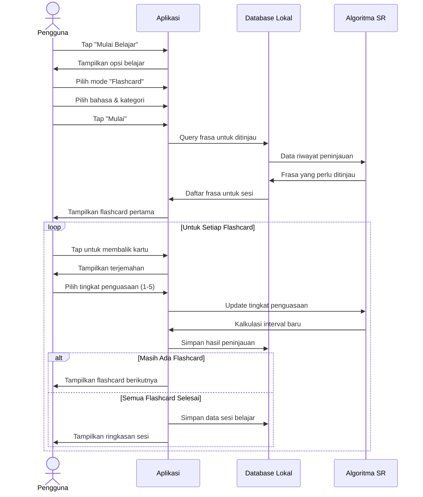
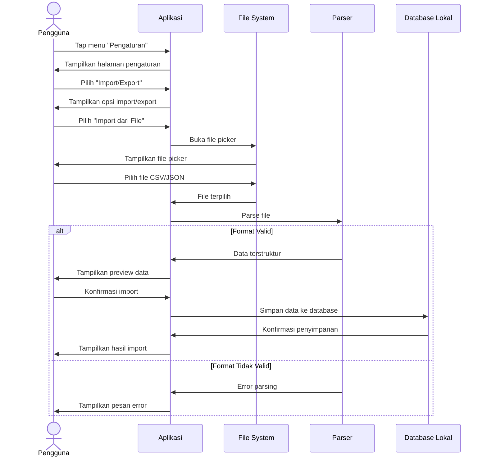

# Spesifikasi Kebutuhan Perangkat Lunak (SKPL)
## Aplikasi Penyimpan Frasa Bahasa NetzLingo (MVP)

**Versi:** 1.1
**Tanggal:** 27/5/2025
**Penyusun:** Rizki Alan Habibi

## Daftar Isi
1. [Pendahuluan](#1-pendahuluan)
2. [Deskripsi Umum](#2-deskripsi-umum)
3. [Persyaratan Fungsional](#3-persyaratan-fungsional)
4. [Persyaratan Non-Fungsional](#4-persyaratan-non-fungsional)
5. [Skema Database AppWrite](#5-skema-database-appwrite)
6. [Antarmuka Pengguna](#6-antarmuka-pengguna)
7. [Alur Pengguna](#7-alur-pengguna)
8. [Timeline Pengembangan](#8-timeline-pengembangan)
9. [Pengujian](#9-pengujian)
10. [Rencana Pengembangan Masa Depan](#10-rencana-pengembangan-masa-depan)
11. [Implementasi](#11-implementasi)
12. [Glosarium](#12-glosarium)

## 1. Pendahuluan

### 1.1 Tujuan
Dokumen ini bertujuan untuk menjelaskan persyaratan dan spesifikasi untuk pengembangan aplikasi NetzLingo, sebuah aplikasi penyimpan frasa bahasa yang memungkinkan pengguna untuk menyimpan, mengorganisir, dan mempelajari frasa atau kata dalam berbagai bahasa dengan mudah dan efektif.

### 1.2 Ruang Lingkup
NetzLingo adalah aplikasi mobile berbasis Flutter dengan penyimpanan cloud yang berfokus pada penyimpanan dan pembelajaran frasa bahasa. Aplikasi ini memungkinkan pengguna untuk mencatat frasa, mengorganisirnya dalam kategori, meninjau dengan algoritma spaced repetition, dan mendapatkan notifikasi pengingat belajar tanpa memerlukan koneksi internet terus-menerus.

### 1.3 Target Pengguna
Target pengguna utama adalah individu berusia 15-60 tahun yang sedang atau ingin mempelajari bahasa asing, seperti:
- Pelajar dan mahasiswa
- Profesional yang bekerja dengan bahasa asing
- Wisatawan dan pelancong internasional
- Penggemar bahasa dan budaya
- Autodidak yang ingin menguasai bahasa baru

### 1.4 Definisi, Akronim, dan Singkatan
- **MVP**: Minimum Viable Product
- **UI**: User Interface
- **UX**: User Experience
- **CRUD**: Create, Read, Update, Delete
- **SKPL**: Spesifikasi Kebutuhan Perangkat Lunak
- **APK**: Android Package Kit
- **SRS**: Spaced Repetition System
- **CSV**: Comma-Separated Values
- **TTS**: Text-to-Speech

### 1.5 Teknologi
- **Frontend**: Flutter (Dart)
- **Penyimpanan Data**: AppWrite (cloud database)
- **Manajemen State**: Provider
- **Autentikasi**: AppWrite Authentication
- **Text-to-Speech**: Flutter TTS
- **Notifikasi**: Flutter Local Notifications
- **Export/Import**: CSV, JSON

### 1.6 Referensi
- Dokumentasi Flutter: [https://flutter.dev/docs](https://flutter.dev/docs)
- Dokumentasi Dart: [https://dart.dev/guides](https://dart.dev/guides)
- Dokumentasi SQLite: [https://www.sqlite.org/docs.html](https://www.sqlite.org/docs.html)
- Dokumentasi Hive: [https://docs.hivedb.dev](https://docs.hivedb.dev)
- Flutter TTS: [https://pub.dev/packages/flutter_tts](https://pub.dev/packages/flutter_tts)
- Algoritma Spaced Repetition: [https://en.wikipedia.org/wiki/Spaced_repetition](https://en.wikipedia.org/wiki/Spaced_repetition)

## 2. Deskripsi Umum

### 2.1 Perspektif Produk
- Aplikasi mobile berbasis Flutter 
- Penyimpanan data cloud dengan AppWrite
- Autentikasi pengguna dengan AppWrite Authentication
- Fitur online-first dengan dukungan offline
- Algoritma spaced repetition untuk peninjauan kata dan frasa
- Pengelompokan frasa berdasarkan bahasa, kategori, dan tingkat penguasaan
- Sinkronisasi data antar perangkat melalui cloud

### 2.2 Fitur Utama Produk (MVP)
1. **Manajemen Frasa**
   * Penambahan frasa baru dengan terjemahan
   * Pengorganisasian dalam bahasa dan kategori
   * Pengeditan dan penghapusan frasa
   * Penandaan favorit dan tingkat kepentingan

2. **Pembelajaran & Peninjauan**
   * Algoritma spaced repetition untuk jadwal peninjauan
   * Mode latihan dengan berbagai format (flashcard, pilihan ganda, pengetikan)
   * Pelacakan kemajuan belajar
   * Statistik penguasaan per bahasa dan kategori

3. **Kustomisasi & Pengaturan**
   * Pemilihan bahasa antarmuka
   * Pengaturan jadwal notifikasi pengingat
   * Preferensi mode latihan
   * Pengaturan tampilan (tema, ukuran font)

4. **Import & Export**
   * Export data ke format CSV/JSON
   * Import frasa dari file CSV/JSON
   * Backup dan restore data lokal
   * Berbagi set frasa dengan pengguna lain

### 2.3 Karakteristik Pengguna
- **Pemula**: Pengguna yang baru memulai belajar bahasa asing dengan pengetahuan terbatas
- **Menengah**: Pengguna yang sudah memiliki dasar bahasa asing dan ingin memperluas kosakata
- **Mahir**: Pengguna yang sudah fasih dan ingin menyimpan frasa atau idiom khusus
- **Ekspektasi Pengguna**: Antarmuka sederhana, kemudahan penggunaan, efektivitas dalam membantu mengingat frasa

### 2.4 Batasan
- Aplikasi berfokus pada penyimpanan dan pembelajaran frasa bahasa
- Tidak menyediakan fitur terjemahan otomatis (pengguna perlu memasukkan terjemahan sendiri)
- Tidak ada fitur sosial atau komunitas dalam MVP
- Kemampuan Text-to-Speech tergantung pada dukungan bahasa di perangkat
- Penyimpanan data terbatas pada kapasitas perangkat pengguna
- Versi gratis dibatasi maksimal 10 sesi latihan per hari

### 2.5 Asumsi dan Ketergantungan
- Pengguna memiliki smartphone dengan OS Android 6.0+ atau iOS 12.0+
- Pengguna memiliki cukup ruang penyimpanan untuk aplikasi dan data frasa
- TTS memerlukan dukungan bahasa yang tersedia di perangkat
- Notifikasi dapat berfungsi pada perangkat pengguna tanpa batasan sistem

## 3. Persyaratan Fungsional

### 3.1 Manajemen Frasa
- **F1.1: Tambah Frasa Baru**
  - **Input**: Frasa asli, terjemahan, bahasa, kategori, catatan (opsional)
  - **Proses**: Validasi input, penyimpanan ke database lokal
  - **Output**: Frasa tersimpan, konfirmasi sukses
  
- **F1.2: Edit Frasa**
  - **Input**: ID frasa, data yang akan diubah
  - **Proses**: Validasi perubahan, pembaruan data
  - **Output**: Frasa terperbarui, konfirmasi sukses
  
- **F1.3: Hapus Frasa**
  - **Input**: ID frasa atau seleksi multiple frasa
  - **Proses**: Konfirmasi penghapusan, penghapusan dari database
  - **Output**: Frasa terhapus, konfirmasi sukses
  
- **F1.4: Organisasi Frasa**
  - **Input**: ID frasa, kategori, tag, tingkat kepentingan
  - **Proses**: Pembaruan metadata frasa
  - **Output**: Frasa terorganisir, konfirmasi sukses

### 3.2 Autentikasi & Manajemen Pengguna
- **F2.1: Registrasi Pengguna**
  - **Input**: Nama, email, password
  - **Proses**: Validasi input, pembuatan akun di AppWrite
  - **Output**: Akun pengguna terdaftar, konfirmasi sukses
  
- **F2.2: Login Pengguna**
  - **Input**: Email, password
  - **Proses**: Autentikasi dengan AppWrite
  - **Output**: Pengguna terotentikasi, akses ke data pribadi
  
- **F2.3: Logout Pengguna**
  - **Input**: Permintaan logout
  - **Proses**: Penghapusan sesi
  - **Output**: Pengguna keluar dari aplikasi
  
- **F2.4: Profil Pengguna**
  - **Input**: Data profil (nama, preferensi)
  - **Proses**: Pembaruan data profil di AppWrite
  - **Output**: Profil terperbarui, konfirmasi sukses
  
- **F2.5: Reset Password**
  - **Input**: Email
  - **Proses**: Pengiriman link reset password
  - **Output**: Email terkirim, instruksi reset password

### 3.3 Manajemen Bahasa & Kategori
- **F3.1: Tambah Bahasa**
  - **Input**: Nama bahasa, kode bahasa, bendera/ikon (opsional)
  - **Proses**: Validasi input, penyimpanan bahasa
  - **Output**: Bahasa tersimpan, konfirmasi sukses
  
- **F3.2: Tambah Kategori**
  - **Input**: Nama kategori, deskripsi (opsional), bahasa terkait
  - **Proses**: Validasi input, penyimpanan kategori
  - **Output**: Kategori tersimpan, konfirmasi sukses
  
- **F3.3: Edit/Hapus Bahasa & Kategori**
  - **Input**: ID bahasa/kategori, data yang akan diubah/konfirmasi hapus
  - **Proses**: Validasi perubahan, pembaruan/penghapusan data
  - **Output**: Data terperbarui/terhapus, konfirmasi sukses
  
- **F3.4: Filter & Sortir Frasa**
  - **Input**: Parameter filter (bahasa, kategori, tingkat kepentingan, dll)
  - **Proses**: Query data sesuai filter
  - **Output**: Daftar frasa terfilter

### 3.4 Pembelajaran & Peninjauan
- **F4.1: Algoritma Spaced Repetition**
  - **Input**: Riwayat peninjauan frasa, tingkat penguasaan
  - **Proses**: Kalkulasi interval peninjauan optimal
  - **Output**: Jadwal peninjauan frasa
  
- **F4.2: Mode Latihan Flashcard**
  - **Input**: Pemilihan bahasa/kategori untuk dipelajari
  - **Proses**: Pemilihan frasa berdasarkan algoritma SR
  - **Output**: Tampilan flashcard dengan frasa untuk dipelajari
  
- **F4.3: Mode Latihan Quiz**
  - **Input**: Pemilihan bahasa/kategori untuk diuji
  - **Proses**: Generasi soal quiz dari frasa tersimpan
  - **Output**: Soal quiz dengan pilihan jawaban
  
- **F4.4: Pelacakan Kemajuan**
  - **Input**: Hasil latihan (benar/salah), waktu respons
  - **Proses**: Pembaruan tingkat penguasaan dan statistik
  - **Output**: Statistik pembelajaran terperbarui

- **F4.5: Manajemen Batasan Latihan Harian**
  - **Input**: Status berlangganan pengguna (gratis/premium)
  - **Proses**: Pengecekan dan pencatatan jumlah sesi latihan yang telah dilakukan hari ini
  - **Output**: Penanda jumlah sesi tersisa atau akses ke latihan tak terbatas (premium)

### 3.5 Notifikasi & Pengingat
- **F5.1: Pengaturan Jadwal**
  - **Input**: Preferensi waktu & frekuensi pengingat
  - **Proses**: Penyimpanan preferensi, penjadwalan notifikasi
  - **Output**: Jadwal notifikasi tersimpan
  
- **F5.2: Kirim Notifikasi**
  - **Input**: Jadwal & template notifikasi
  - **Proses**: Pembuatan notifikasi pada waktu yang ditentukan
  - **Output**: Notifikasi muncul di device pengguna
  
- **F5.3: Pengingat Cerdas**
  - **Input**: Data peninjauan pengguna, pola belajar
  - **Proses**: Analisis waktu optimal untuk belajar
  - **Output**: Penjadwalan notifikasi berdasarkan pola pengguna

### 3.6 Import & Export
- **F6.1: Export Data**
  - **Input**: Pilihan format (CSV/JSON) dan cakupan data
  - **Proses**: Konversi data ke format yang dipilih
  - **Output**: File export tersimpan di perangkat
  
- **F6.2: Import Data**
  - **Input**: File CSV/JSON dengan format yang valid
  - **Proses**: Parsing data, validasi, dan penyimpanan
  - **Output**: Data terimport, konfirmasi sukses
  
- **F6.3: Backup & Restore**
  - **Input**: Permintaan backup/restore, file backup
  - **Proses**: Pembuatan backup database/restore dari file
  - **Output**: Backup tersimpan/data ter-restore

### 3.7 Model Data

#### 3.7.1 Model: `languages`
```dart
class Language {
  final String id;      // Primary Key
  final String name;    // ex: "English", "Français"
  final String code;    // ex: "en", "fr"
  final String? flagIcon;
  final String userId;  // Foreign Key to users
  final DateTime createdAt;
  final DateTime updatedAt;
  
  // Constructor dan methods
}
```

#### 3.7.2 Model: `categories`
```dart
class Category {
  final String id;      // Primary Key
  final String name;    // ex: "Greetings", "Food"
  final String? description;
  final String? languageId; // Foreign Key to languages (optional)
  final String userId;  // Foreign Key to users
  final DateTime createdAt;
  final DateTime updatedAt;
  
  // Constructor dan methods
}
```

#### 3.7.3 Model: `phrases`
```dart
class Phrase {
  final String id;      // Primary Key
  final String originalText;
  final String translatedText;
  final String languageId; // Foreign Key to languages
  final String? categoryId; // Foreign Key to categories
  final String? notes;
  final bool isFavorite;
  final int importance;  // 1-5 scale
  final String userId;   // Foreign Key to users
  final DateTime createdAt;
  final DateTime updatedAt;
  
  // Constructor dan methods
}
```

#### 3.7.4 Model: `phrase_tags`
```dart
class PhraseTag {
  final String id;      // Primary Key
  final String phraseId;   // Foreign Key to phrases
  final String tagId;      // Foreign Key to tags
  final String userId;     // Foreign Key to users
  
  // Constructor dan methods
}
```

#### 3.7.5 Model: `tags`
```dart
class Tag {
  final String id;      // Primary Key
  final String name;    // ex: "Slang", "Formal", "Business"
  final String? color;
  final String userId;     // Foreign Key to users
  final DateTime createdAt;
  
  // Constructor dan methods
}
```

#### 3.7.6 Model: `review_history`
```dart
class ReviewHistory {
  final String id;      // Primary Key
  final String phraseId;   // Foreign Key to phrases
  final String userId;     // Foreign Key to users
  final DateTime reviewDate;
  final bool wasCorrect;
  final double easeFactor; // Algorithm factor for SR
  final int interval;   // Days until next review
  
  // Constructor dan methods
}
```

#### 3.7.7 Model: `study_sessions`
```dart
class StudySession {
  final String id;      // Primary Key
  final String userId;     // Foreign Key to users
  final DateTime startTime;
  final DateTime? endTime;
  final int totalPhrases;
  final int correctAnswers;
  final String sessionType; // "flashcard", "quiz", "typing"
  final String? languageId;   // Foreign Key to languages (optional)
  final String? categoryId;   // Foreign Key to categories (optional)
  
  // Constructor dan methods
}
```

#### 3.7.8 Model: `settings`
```dart
class AppSettings {
  final String id;      // Primary Key
  final String userId;     // Foreign Key to users
  final String appLanguage;
  final String theme;
  final bool isDarkMode;
  final bool enableTTS;
  final bool enableNotifications;
  final String notificationTime;
  final int dailyGoal;   // Number of phrases
  final bool isPremium;  // Status berlangganan
  final int dailySessionCount; // Jumlah sesi yang telah dilakukan hari ini
  final DateTime? lastSessionDate; // Tanggal terakhir sesi latihan
  final DateTime updatedAt;
  
  // Constructor dan methods
}
```

## 4. Persyaratan Non-Fungsional

### 4.1 Kegunaan
- **NF1.1**: Antarmuka pengguna intuitif dengan tombol dan menu yang mudah dipahami
- **NF1.2**: Waktu belajar pengguna maksimal 5 menit untuk memahami cara menggunakan fitur utama
- **NF1.3**: Konsistensi dalam desain UI di seluruh aplikasi
- **NF1.4**: Responsif terhadap orientasi layar (potrait dan landscape)

### 4.2 Kinerja
- **NF2.1**: Waktu loading aplikasi maksimal 3 detik pada perangkat standar
- **NF2.2**: Konsumsi memori tidak melebihi 100MB saat digunakan
- **NF2.3**: Respons terhadap interaksi pengguna dalam waktu kurang dari 0.5 detik
- **NF2.4**: Performa tetap stabil hingga 10.000 frasa tersimpan

### 4.3 Keandalan
- **NF3.1**: Aplikasi harus menyimpan progress belajar secara otomatis
- **NF3.2**: Tidak ada kehilangan data saat perangkat kehabisan baterai
- **NF3.3**: Pemulihan otomatis dari crash dengan minimal kehilangan data
- **NF3.4**: Fungsionalitas offline 100% tanpa degradasi performa

### 4.4 Keamanan
- **NF4.1**: Data pengguna disimpan secara lokal dengan enkripsi dasar
- **NF4.2**: Opsi untuk mengamankan aplikasi dengan PIN/biometrik
- **NF4.3**: Backup data dienkripsi sebelum disimpan
- **NF4.4**: Tidak ada transmisi data tanpa persetujuan pengguna

### 4.5 Portabilitas
- **NF5.1**: Aplikasi berjalan pada Android 6.0+ dan iOS 12.0+
- **NF5.2**: Adaptasi terhadap berbagai ukuran layar (4"-10")
- **NF5.3**: Format data export kompatibel dengan aplikasi lain (standar CSV/JSON)
- **NF5.4**: Adaptasi terhadap berbagai DPI dan resolusi layar

## 5. Skema Database AppWrite

### 5.1 Koleksi `users`
- id (PK): STRING
- name: STRING NOT NULL
- email: STRING NOT NULL
- is_premium: BOOLEAN DEFAULT FALSE
- created_at: DATETIME
- updated_at: DATETIME
- daily_goal: INTEGER DEFAULT 10
- preferred_language: STRING DEFAULT 'id'

### 5.2 Koleksi `languages`
- id (PK): STRING
- name: STRING NOT NULL
- code: STRING NOT NULL
- flag_icon: STRING
- user_id (FK): STRING NOT NULL
- created_at: DATETIME
- updated_at: DATETIME

### 5.3 Koleksi `categories`
- id (PK): STRING
- name: STRING NOT NULL
- description: STRING
- language_id (FK): STRING
- user_id (FK): STRING NOT NULL
- created_at: DATETIME
- updated_at: DATETIME

### 5.4 Koleksi `phrases`
- id (PK): STRING
- original_text: STRING NOT NULL
- translated_text: STRING NOT NULL
- language_id (FK): STRING NOT NULL
- category_id (FK): STRING
- user_id (FK): STRING NOT NULL
- notes: STRING
- is_favorite: BOOLEAN DEFAULT FALSE
- importance: INTEGER DEFAULT 1
- created_at: DATETIME
- updated_at: DATETIME

### 5.5 Koleksi `tags`
- id (PK): STRING
- name: STRING NOT NULL
- color: STRING
- user_id (FK): STRING NOT NULL
- created_at: DATETIME

### 5.6 Koleksi `phrase_tags`
- id (PK): STRING
- phrase_id (FK): STRING NOT NULL
- tag_id (FK): STRING NOT NULL
- user_id (FK): STRING NOT NULL

### 5.7 Koleksi `review_history`
- id (PK): STRING
- phrase_id (FK): STRING NOT NULL
- user_id (FK): STRING NOT NULL
- review_date: DATETIME NOT NULL
- was_correct: BOOLEAN NOT NULL
- ease_factor: FLOAT NOT NULL
- interval: INTEGER NOT NULL

### 5.8 Koleksi `study_sessions`
- id (PK): STRING
- user_id (FK): STRING NOT NULL
- start_time: DATETIME NOT NULL
- end_time: DATETIME
- total_phrases: INTEGER NOT NULL
- correct_answers: INTEGER NOT NULL
- session_type: STRING NOT NULL
- language_id (FK): STRING
- category_id (FK): STRING

### 5.9 Koleksi `settings`
- id (PK): STRING
- user_id (FK): STRING NOT NULL
- app_language: STRING NOT NULL
- theme: STRING NOT NULL
- is_dark_mode: BOOLEAN DEFAULT FALSE
- enable_tts: BOOLEAN DEFAULT TRUE
- enable_notifications: BOOLEAN DEFAULT TRUE
- notification_time: STRING DEFAULT '20:00'
- daily_goal: INTEGER DEFAULT 10
- is_premium: BOOLEAN DEFAULT FALSE
- daily_session_count: INTEGER DEFAULT 0
- last_session_date: DATETIME
- updated_at: DATETIME

### 5.10 Relasi
- User (1) → Languages (N): Satu user dapat memiliki banyak bahasa
- User (1) → Categories (N): Satu user dapat memiliki banyak kategori
- User (1) → Phrases (N): Satu user dapat memiliki banyak frasa
- Language (1) → Phrases (N): Satu bahasa dapat memiliki banyak frasa
- Category (1) → Phrases (N): Satu kategori dapat memiliki banyak frasa
- Phrase (1) → ReviewHistory (N): Satu frasa dapat memiliki banyak riwayat peninjauan
- Phrase (N) ↔ Tags (M): Hubungan many-to-many antara frasa dan tag
- Language (1) → Categories (N): Satu bahasa dapat memiliki banyak kategori (opsional)

## 6. Antarmuka Pengguna

### 6.1 Halaman Beranda
- Dashboard dengan statistik belajar
- Daftar frasa yang perlu ditinjau hari ini
- Tombol cepat untuk menambah frasa baru
- Ringkasan progress per bahasa

### 6.2 Halaman Manajemen Frasa
- Daftar frasa yang dapat dicari dan difilter
- Tampilan grid/list dengan informasi singkat frasa
- Opsi untuk menandai favorit dan mengatur tingkat kepentingan
- Tombol untuk menambah, mengedit, dan menghapus frasa

### 6.3 Halaman Detail Frasa
- Tampilan lengkap frasa dan terjemahan
- Catatan dan informasi tambahan
- Riwayat peninjauan dan tingkat penguasaan
- Tombol untuk mendengarkan pengucapan (TTS)

### 6.4 Halaman Belajar
- Pemilihan mode latihan (flashcard, quiz, pengetikan)
- Pemilihan bahasa dan kategori untuk dipelajari
- Pengaturan sesi belajar (jumlah frasa, durasi)
- Indikator kemajuan sesi belajar
- Indikator jumlah sesi latihan tersisa hari ini (untuk pengguna gratis)

### 6.5 Mode Latihan Flashcard
- Kartu dengan frasa asli dan terjemahan
- Tombol untuk membalik kartu
- Tombol penilaian tingkat penguasaan
- Navigasi antar flashcard

### 6.6 Mode Latihan Quiz
- Soal dalam berbagai format (pilihan ganda, benar/salah)
- Timer opsional untuk jawaban
- Feedback langsung atas jawaban
- Ringkasan hasil di akhir quiz

### 6.7 Halaman Statistik
- Grafik kemajuan belajar
- Tingkat penguasaan per bahasa dan kategori
- Riwayat sesi belajar
- Streak dan pencapaian

### 6.8 Halaman Pengaturan
- Preferensi tampilan dan tema
- Pengaturan notifikasi dan pengingat
- Opsi backup dan restore
- Pengaturan Text-to-Speech

## 7. Alur Pengguna

### 7.1 Alur Penambahan Frasa Baru



### 7.2 Alur Sesi Belajar Flashcard



### 7.3 Alur Import Data



## 8. Timeline Pengembangan

### 8.1 Fase Persiapan (1 minggu)
- Perencanaan & Desain (3 hari)
- Setup Lingkungan Pengembangan (4 hari)
  * Inisialisasi proyek Flutter
  * Konfigurasi database lokal
  * Setup repository dan struktur proyek

### 8.2 Fase Pengembangan (8 minggu)
- **Iterasi 1: Struktur Dasar & Manajemen Frasa (2 minggu)**
  * Setup database lokal
  * Implementasi model data
  * CRUD untuk frasa, bahasa, dan kategori
  * UI dasar untuk manajemen frasa

- **Iterasi 2: Sistem Pembelajaran (2 minggu)**
  * Implementasi algoritma spaced repetition
  * Mode latihan flashcard
  * Mode latihan quiz
  * Pelacakan kemajuan belajar

- **Iterasi 3: Notifikasi & TTS (2 minggu)**
  * Integrasi Text-to-Speech
  * Sistem notifikasi lokal
  * Pengingat cerdas
  * Pengaturan preferensi notifikasi

- **Iterasi 4: Import/Export & UI/UX (2 minggu)**
  * Fitur export/import data
  * Backup dan restore
  * Penyempurnaan UI/UX
  * Optimasi performa

### 8.3 Fase Testing (3 minggu)
- Testing Internal (1 minggu)
- User Testing (1 minggu)
- Perbaikan Bug (1 minggu)

### 8.4 Fase Deployment (3 minggu)
- Persiapan Deployment (1 minggu)
- Deployment MVP (1 minggu)
- Monitoring & Evaluasi (1 minggu)

## 9. Pengujian

### 9.1 Pengujian Unit
- Test model data dan validasi
- Test algoritma spaced repetition
- Test CRUD operations
- Test parser import/export

### 9.2 Pengujian Integrasi
- Test workflow penambahan frasa end-to-end
- Test sesi belajar complete cycle
- Test notifikasi dan TTS
- Test backup dan restore

### 9.3 Pengujian Penerimaan Pengguna
- Usability testing dengan pengguna potensial
- A/B testing untuk alur pembelajaran
- Performance testing pada berbagai perangkat
- Compatibility testing pada berbagai OS dan versi

## 10. Rencana Pengembangan Masa Depan (Post-MVP)

### 10.1 Fitur Jangka Pendek
- Sinkronisasi cloud opsional untuk backup
- Integrasi dengan API kamus untuk sugesti terjemahan
- Mode pembelajaran kontekstual dengan contoh kalimat
- Widget home screen untuk quick review
- Model berlangganan premium dengan fitur:
  * Latihan tak terbatas per hari
  * Lebih banyak bahasa dan frasa
  * Fitur analisis lanjutan
  * Ekspor data dalam format tambahan

### 10.2 Fitur Jangka Menengah
- Fitur gamifikasi (achievement, level, badges)
- Mode latihan berdasarkan konteks (situasi, tema)
- Pengenalan karakter dan alfabet untuk bahasa non-latin
- Analisis lanjutan untuk performa belajar

### 10.3 Fitur Jangka Panjang
- Komunitas berbagi set frasa
- Mode multiplayer untuk belajar bersama
- Integrasi AI untuk rekomendasi pembelajaran
- Perluasan ke platform web dan desktop

## 11. Implementasi

### 11.1 Rencana Implementasi

#### Struktur Proyek
```
├── lib/
│   ├── main.dart
│   ├── app.dart
│   ├── config/
│   │   ├── appwrite_constants.dart
│   │   └── app_constants.dart
│   ├── screens/
│   │   ├── auth/
│   │   │   ├── login_screen.dart
│   │   │   ├── register_screen.dart
│   │   │   └── profile_screen.dart
│   │   ├── home/
│   │   ├── phrase_management/
│   │   ├── study/
│   │   ├── statistics/
│   │   └── settings/
│   ├── widgets/
│   │   ├── auth/
│   │   ├── phrase/
│   │   ├── study/
│   │   ├── common/
│   │   └── statistics/
│   ├── models/
│   │   ├── user_model.dart
│   │   ├── language.dart
│   │   ├── category.dart
│   │   ├── phrase.dart
│   │   ├── tag.dart
│   │   ├── review_history.dart
│   │   ├── study_session.dart
│   │   └── settings.dart
│   ├── providers/
│   │   ├── auth_provider.dart
│   │   ├── language_provider.dart
│   │   ├── phrase_provider.dart
│   │   ├── study_provider.dart
│   │   └── settings_provider.dart
│   ├── services/
│   │   ├── appwrite_service.dart
│   │   ├── auth_service.dart
│   │   ├── user_service.dart
│   │   ├── language_service.dart
│   │   ├── phrase_service.dart
│   │   ├── category_service.dart
│   │   ├── tag_service.dart
│   │   ├── tts_service.dart
│   │   ├── notification_service.dart
│   │   ├── spaced_repetition_service.dart
│   │   └── import_export_service.dart
│   └── utils/
│       ├── constants.dart
│       ├── helpers.dart
│       ├── validators.dart
│       └── formatters.dart
├── assets/
└── pubspec.yaml
```

#### Persiapan dan Setup (1 minggu)
```bash
# Inisialisasi proyek Flutter
flutter create netzlingo
cd netzlingo

# Instalasi dependensi
flutter pub add appwrite
flutter pub add provider
flutter pub add flutter_tts
flutter pub add flutter_local_notifications
flutter pub add shared_preferences
flutter pub add intl
flutter pub add uuid
flutter pub add csv
flutter pub add file_picker
flutter pub add permission_handler
flutter pub add fl_chart
flutter pub add google_fonts
flutter pub add flutter_secure_storage
```

### 11.2 Tech Stack

1. **Frontend**
   * Flutter 3.x
   * Dart
   * Provider (State Management)
   * Material Design / Cupertino

2. **Backend & Storage**
   * AppWrite (Cloud Database)
   * AppWrite Authentication
   * AppWrite Storage (untuk file)
   * AppWrite Realtime (untuk sinkronisasi)
   * Shared Preferences (untuk pengaturan lokal)

3. **Fitur Khusus**
   * Flutter TTS (untuk text-to-speech)
   * Flutter Local Notifications
   * File Picker (import/export)
   * FL Chart (untuk visualisasi statistik)
   * Flutter Secure Storage (untuk data sensitif)

4. **DevOps**
   * Git & GitHub
   * Flutter Testing Framework

### 11.3 Strategi Testing & Deployment

#### Testing Strategy
- **Unit Testing**: Model dan algoritma utama
- **Widget Testing**: Komponen UI penting
- **Integration Testing**: Alur pengguna utama
- **User Testing**: Testing dengan pengguna potensial

#### Deployment Workflow
1. Development di environment lokal
2. Push ke repository Git
3. CI/CD dengan Flutter testing
4. Testing pada berbagai perangkat (manual)
5. Deployment ke Google Play (Internal Testing)
6. Deployment ke App Store (TestFlight)
7. Release ke Google Play dan App Store

## 12. Glosarium

- **Frasa**: Kumpulan kata atau ungkapan dalam suatu bahasa
- **Spaced Repetition**: Metode pembelajaran dengan interval waktu yang meningkat
- **TTS**: Text-to-Speech, teknologi yang mengkonversi teks menjadi suara
- **Flashcard**: Kartu pembelajaran dengan pertanyaan di satu sisi dan jawaban di sisi lain
- **Kategori**: Pengelompokan frasa berdasarkan tema atau topik
- **Tag**: Label tambahan yang dapat ditambahkan ke frasa untuk pengorganisasian
- **Ease Factor**: Faktor dalam algoritma SR yang menentukan kesulitan mengingat
- **CSV**: Comma-Separated Values, format file untuk menyimpan data tabular

---

*Dokumen ini merupakan spesifikasi untuk pengembangan MVP NetzLingo menggunakan Flutter dan dapat berubah sesuai dengan kebutuhan dan umpan balik selama proses pengembangan.* 