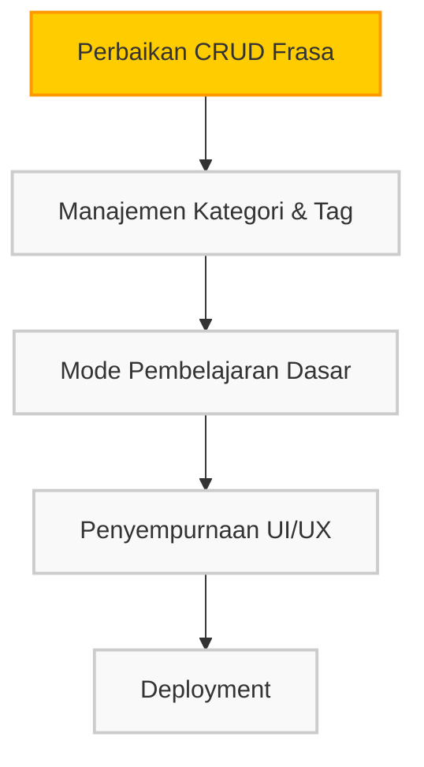

# NetzLingo - Aplikasi Penyimpan Frasa Bahasa

## Gambaran Umum

NetzLingo adalah aplikasi mobile yang memungkinkan pengguna menyimpan, mengorganisir, dan mempelajari frasa dalam berbagai bahasa. Aplikasi dikembangkan dengan Flutter dan menggunakan AppWrite sebagai backend cloud.

## Status Pengembangan

Status: **Pengembangan Aktif** (MVP - Minimum Viable Product)

### Fitur yang Sudah Diimplementasikan
- ✅ Autentikasi Pengguna (Registrasi, Login, Logout)
- ✅ Struktur Dasar Aplikasi dengan State Management (Provider)
- ✅ Integrasi dengan AppWrite Cloud
- ✅ UI Dasar untuk Manajemen Frasa (Tampilan Daftar & Kartu Frasa)
- ✅ Sistem Data Universal untuk Akses Publik

### Fitur yang Sedang Dikerjakan
- 🟡 CRUD Frasa (Perbaikan Bug Penambahan & Update Frasa)
- 🟡 Penanganan Permissions AppWrite
- 🟡 Sistem Fallback Data untuk Keandalan

### Fitur yang Direncanakan
- ⬜ Manajemen Kategori & Tag yang Lebih Baik
- ⬜ Mode Pembelajaran (Flashcard, Quiz, Typing)
- ⬜ Pengaturan Tema Aplikasi (Terang/Gelap)
- ⬜ Integrasi Text-to-Speech

## Perubahan Terbaru

### Perbaikan Bug CRUD Frasa
- Penanganan error yang lebih baik untuk mengatasi masalah permissions AppWrite
- Implementasi sistem fallback untuk menghindari crash saat operasi database gagal
- Perbaikan mekanisme pembuatan/pembaruan frasa dengan pendekatan yang lebih robust

### Revisi Rencana Iterasi
- Iterasi pengembangan telah disederhanakan menjadi 4 iterasi utama
- Fokus pada fungsi dasar yang stabil daripada fitur kompleks
- Penundaan fitur statistik dan fitur premium

## Panduan Pengembangan

### Struktur Proyek
```
lib/
  ├── config/         # Konfigurasi AppWrite
  ├── models/         # Model data aplikasi
  ├── providers/      # Provider State Management
  ├── screens/        # UI Screens
  ├── services/       # Service Layer & API
  ├── utils/          # Helper & Utilitas
  └── widgets/        # Widget yang dapat digunakan kembali
```

### Setup Pengembangan
1. Clone repository
2. `flutter pub get` untuk mendapatkan dependencies
3. Sesuaikan `lib/config/appwrite_constants.dart` dengan informasi project AppWrite Anda
4. `flutter run` untuk menjalankan aplikasi

### Fokus Pengembangan Berikutnya
1. **Perbaikan CRUD Frasa**
   - Fokus pada perbaikan bugs yang ada di `phrase_service.dart`
   - Pastikan fungsi tambah, edit, dan hapus frasa berjalan dengan stabil

2. **Penyempurnaan UI Dasar**
   - Pastikan UI responsif dan menarik
   - Implementasi feedback visual yang baik untuk pengguna

3. **Mode Pembelajaran Dasar**
   - Mulai dengan mode Flashcard sederhana
   - Pastikan akses universal ke data berfungsi dengan baik

## Alur Pengembangan 



## Pengembang

- **Rizki Alan Habibi** - Pengembang Utama

## Catatan Penggunaan AppWrite

Untuk mengatasi masalah permissions di AppWrite:

1. **Collections Settings**
   - Pastikan collection memiliki permission `read` untuk `any`
   - Gunakan Document Security untuk kontrol akses lebih detail

2. **Pendekatan Fallback Data**
   - User Pribadi → Data Universal → Data Statis Bawaan

## Lisensi

Hak Cipta © 2025 NetzLingo
